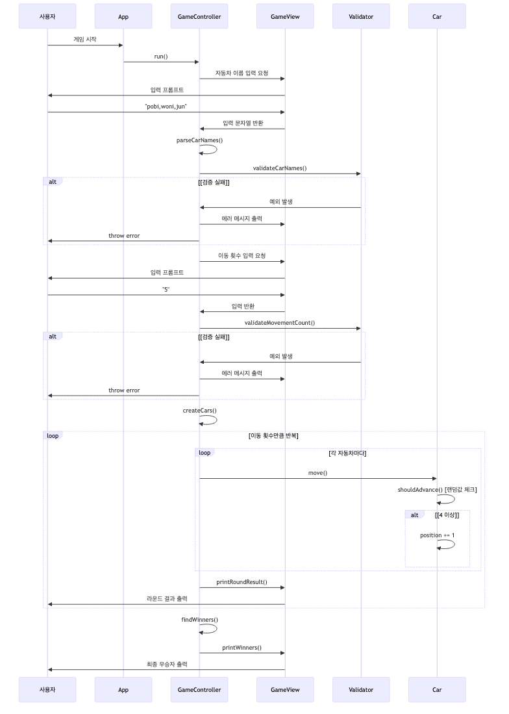
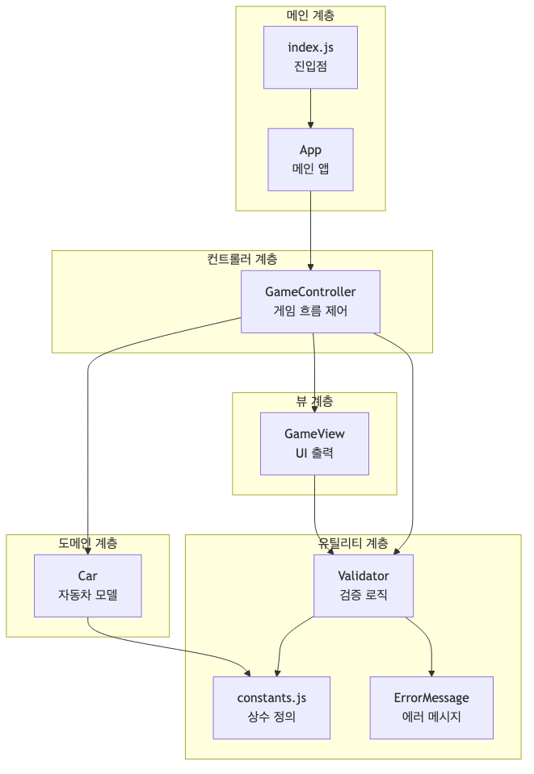

# 자동차 경주 게임

> SOLID 원칙과 MVC 패턴을 적용한 객체지향 자동차 경주 게임

## 목차

- [프로젝트 개요](#프로젝트-개요)
- [시스템 아키텍처](#시스템-아키텍처)
- [주요 기능](#주요-기능)
- [예외 처리](#예외-처리)
- [리팩토링 이력](#리팩토링-이력)
- [최종 결과](#최종-결과)

## 프로젝트 개요

자동차 경주 게임은 객체지향 설계 원칙을 준수하여 구현된 콘솔 게임입니다. MVC 패턴을 적용하여 관심사를 분리하고, 단일 책임 원칙을 준수하여 유지보수성을 높였습니다.

### 핵심 원칙
- **SOLID 원칙**: 각 클래스는 단일 책임만 수행
- **MVC 패턴**: Model-View-Controller 완전 분리
- **Indent Depth**: 최대 2 (요구사항 준수)

## 시스템 아키텍처

### 파일 구조

```
src/
├── constants/          # 상수 및 에러 메시지
│   ├── constants.js
│   └── ErrorMessage.js
├── models/             # 도메인 모델
│   └── Car.js
├── validators/         # 검증 로직
│   └── Validator.js
├── views/              # UI 출력
│   └── GameView.js
├── controllers/        # 게임 컨트롤러
│   └── GameController.js
├── App.js              # 메인 앱
└── index.js            # 진입점
```

### 시스템 실행 흐름



### 계층 구조



## 주요 기능

### 입력 및 검증
- **자동차 이름**: 쉼표로 구분, 최대 5자, 공백 불가
- **이동 횟수**: 양의 정수만 입력 가능

### 게임 로직
- **전진 조건**: 랜덤값(0~9)이 4 이상일 때 전진
- **실시간 결과**: 각 라운드마다 자동차 위치 출력
- **우승자 판정**: 최대 전진 거리를 가진 자동차(들) 선정

### 게임 흐름
1. 자동차 이름 입력 및 검증
2. 이동 횟수 입력 및 검증
3. 자동차 객체 생성
4. 라운드별 게임 진행 및 결과 출력
5. 최종 우승자 판정 및 출력

## 예외 처리

### 검증 규칙

| 분류 | 규칙 | 잘못된 예시 |
|------|------|------------|
| **자동차 이름** | 빈 문자열, 5자 초과, 공백 포함 불가 | `""`, `javaji`, `car 1` |
| **이동 횟수** | 빈 문자열, 음수, 소수, 공백 포함 불가 | `""`, `0`, `-5`, `3.5`, ` 5 ` |

### 검증 로직

```javascript
// 자동차 이름 검증 (세분화된 에러 메시지)
Validator.validateCarNames(carNames);
// 체크 항목:
// - 빈 문자열 입력
// - 5자 초과
// - 공백 포함 (앞/뒤/중간)
// - 빈 이름 포함 (쉼표로 구분된 빈 값)

// 이동 횟수 검증 (세분화된 에러 메시지)
Validator.validateMovementCount(movementCountInput);
// 체크 항목:
// - 빈 문자열
// - 음수
// - 0
// - 소수점
// - 공백 포함
// - 특수문자
```

## 리팩토링 이력

### 1. 코드 분리 (178줄 → 230줄)

**문제점**
- 모든 로직이 `App.js`에 집중
- 단일 책임 원칙 위배
- 코드 재사용성 및 테스트 어려움

**해결방안**
- 8개 파일로 분리
- App.js: 178줄 → 35줄 (80% 감소)
- 각 모듈의 책임 명확화

**결과**
```javascript
// Before: 178줄
App.js (모든 로직 포함)

// After: 35줄
App.js (GameController만 호출)
GameController.js (게임 흐름 제어)
GameView.js (UI 출력)
Validator.js (검증 로직)
Car.js (자동차 모델)
```

### 2. 에러 메시지 세분화 및 중앙 관리

**문제점**
- 에러 메시지 여러 곳에 하드코딩
- 일반적인 에러 메시지로 구체적인 문제 파악 어려움

**해결방안**
```javascript
// ErrorMessage.js
export class ErrorMessage {
  // 자동차 이름 관련 (4가지)
  static EMPTY_CAR_NAMES = "[ERROR] 자동차 이름을 입력해주세요.";
  static INVALID_CAR_NAME_LENGTH = "[ERROR] 자동차 이름은 5자 이하만 가능합니다.";
  static INVALID_CAR_NAME_SPACE = "[ERROR] 자동차 이름에 공백이 포함될 수 없습니다.";
  static EMPTY_CAR_NAME_IN_LIST = "[ERROR] 빈 자동차 이름이 포함되어 있습니다.";
  
  // 이동 횟수 관련 (5가지)
  static EMPTY_MOVEMENT_COUNT = "[ERROR] 시도할 횟수를 입력해주세요.";
  static INVALID_MOVEMENT_COUNT_NEGATIVE = "[ERROR] 시도 횟수는 1 이상이어야 합니다.";
  static INVALID_MOVEMENT_COUNT_ZERO = "[ERROR] 시도 횟수는 0보다 커야 합니다.";
  static INVALID_MOVEMENT_COUNT_DECIMAL = "[ERROR] 시도 횟수는 정수여야 합니다.";
  static INVALID_MOVEMENT_COUNT_SPACE = "[ERROR] 시도 횟수에 공백이 포함될 수 없습니다.";
  static INVALID_NUMBER_FORMAT = "[ERROR] 숫자만 입력해주세요.";
}
```

**장점**
- 메시지 변경 시 한 파일만 수정
- IDE 자동완성 지원
- 구체적인 에러 원인 파악 용이
- 사용자에게 명확한 피드백 제공

### 3. MissionUtils API 수정

**에러**
```
Error: arguments must be 1
    at MissionUtils.Console.readLineAsync
```

**원인**
- `readLineAsync()` 인자 중복 전달

**해결**
```javascript
// Before
const input = await GameView.readLine(message);
GameView.print(message); // 중복 출력

// After
static async readLine(query) {
  MissionUtils.Console.print(query);
  return await MissionUtils.Console.readLineAsync("> ");
}
```

### 4. 랜덤값 범위 오류 수정

**원인**
- 요구사항: 0~9 랜덤값, 4 이상일 때 전진
- 잘못된 구현: 4~9만 선택

**해결**
```javascript
// Before (잘못됨)
const randomNumber = Random.pickNumberInRange(4, 9);

// After (올바름)
const randomNumber = Random.pickNumberInRange(0, 9);
return randomNumber >= 4;
```

### 5. 검증 로직 통합 및 변수명 개선

**문제점**
- 검증 로직 여러 곳에 산재
- 중복 코드 존재
- 변수명이 애매함 (`name`, `input`, `number`)

**해결방안**
- `Validator` 클래스로 통합
- 변수명 명확화:
  - `name` → `carName`
  - `trimmedName` → `trimmedCarName`
  - `input` → `movementCountInput`
  - `trimmedInput` → `trimmedMovementCount`
  - `number` → `movementCount`
- JSDoc 주석 추가

**장점**
- 변수 의미가 한눈에 파악 가능
- 검증 로직이 명확하게 이해됨
- 코드 가독성 향상

## 최종 결과

### 코드 메트릭

| 항목 | 값 |
|------|-----|
| 총 라인 수 | 297줄 (8개 파일) |
| App.js 라인 수 | 14줄 (최소화) |
| 평균 파일 크기 | ~37줄 |
| Indent Depth | 최대 2 |
| 테스트 통과율 | 16/16 (100%) |

### 디자인 패턴

- **Repository Pattern**: `ErrorMessage.js`, `constants.js` - 데이터 중앙 관리
- **Strategy Pattern**: `Validator.js` - 검증 전략 캡슐화
- **MVC Pattern**: Model(Car) - View(GameView) - Controller(GameController)
- **Facade Pattern**: `App.js` - 복잡한 시스템 단순화

### 테스트 결과

**기능 테스트 (4개)**
- 단일 라운드에서 단독 우승자 결정
- 여러 라운드 경주 진행
- 공동 우승자 결정
- 3대의 자동차가 다른 거리 이동

**예외 처리 테스트 (12개)**
- 자동차 이름 검증 (5개): 5자 초과, 빈 문자열, 공백 포함, 앞뒤 공백, 빈 이름 포함
- 이동 횟수 검증 (7개): 빈 문자열, 숫자 아님, 음수, 0, 소수, 공백 포함, 특수문자

**BDD 패턴 적용**
- Given-When-Then 주석으로 테스트 구조 명확화
- 모든 테스트 케이스에 일관된 구조 적용
